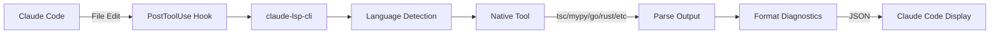

# Claude Code LSP

A lightweight, file-based diagnostics CLI for Claude Code that provides real-time type checking and error detection for 11+ programming languages without requiring language servers.

## ✨ Features

- **🚀 Direct Tool Invocation** - No language servers needed, uses native compilers/linters
- **📦 Single Binary** - Compiled with Bun for fast execution
- **🔧 Auto-Installation** - Hooks automatically installed to Claude Code
- **🎯 Smart Deduplication** - Only shows diagnostics when they change
- **🌍 11+ Languages** - TypeScript, Python, Go, Rust, Java, C++, PHP, Scala, Lua, Elixir, Terraform
- **⚡ Fast & Lightweight** - File-based checking with minimal overhead

## 📦 Installation

### From Source (Recommended)

```bash
# Clone the repository
git clone https://github.com/teamchong/claude-code-lsp.git
cd claude-code-lsp

# Install with automatic setup
./install.sh
```

The `install.sh` script automatically:
1. Installs Bun runtime if not present
2. Builds the CLI binary with `bun run build`
3. Installs binary to `/usr/local/bin/claude-lsp-cli` (requires sudo)
4. Adds PostToolUse and UserPromptSubmit hooks to `~/.claude/settings.json`
5. Updates `~/.claude/CLAUDE.md` with usage instructions
6. Cleans up old socket and state files

### From NPM (Coming Soon)

```bash
# Install globally
npm install -g claude-code-lsp

# Or use directly with npx
npx claude-lsp-cli diagnostics src/file.ts
```

## 🎯 Usage

### CLI Commands

```bash
# Show help
claude-lsp-cli

# Check a specific file
claude-lsp-cli diagnostics src/index.ts

# Enable/disable languages
claude-lsp-cli disable python
claude-lsp-cli enable python
```

### Quick Commands in Claude Code

After installation, you can use these shortcuts in new Claude Code session:

- `>lsp:` - Show available commands
- `>lsp: status` - Show enabled/disabled languages
- `>lsp: enable <language>` - Enable a language checker
- `>lsp: disable <language>` - Disable a language checker
- `>lsp: check <file>` - Manually check a file

**Note:** Commands must be on a single line only.

## 🔧 How It Works

### Architecture



### Hook System

The CLI integrates with Claude Code through two hooks:

1. **PostToolUse Hook** - Automatically checks files after edits
2. **UserPromptSubmit Hook** - Handles `>lsp:` commands

### Deduplication

To prevent spam, the system tracks diagnostics per project:
- State files: `/tmp/claude-lsp-last-{project-hash}.json`
- Only shows output when diagnostics change
- Per-project tracking for multi-project workspaces

## 🌍 Language Support

| Language | Tool Used | File Extensions | Status |
|----------|-----------|-----------------|--------|
| TypeScript | `tsc --noEmit` | `.ts, .tsx` | ✅ Enabled |
| Python | `pyright` or `mypy` | `.py` | ✅ Enabled |
| Go | `go build` | `.go` | ✅ Enabled |
| Rust | `rustc --error-format json` | `.rs` | ✅ Enabled |
| Java | `javac` | `.java` | ✅ Enabled |
| C/C++ | `g++` or `clang++` | `.cpp, .cc, .c` | ✅ Enabled |
| PHP | `php -l` | `.php` | ✅ Enabled |
| Scala | `scalac` | `.scala` | ✅ Enabled |
| Lua | `lua -l` | `.lua` | ✅ Enabled |
| Elixir | `elixir -c` | `.ex, .exs` | ✅ Enabled |
| Terraform | `terraform validate` | `.tf` | ✅ Enabled |

## 🧪 Testing

Test the diagnostics with example files:

```bash
# TypeScript - multiple errors
claude-lsp-cli diagnostics examples/typescript-project/src/index.ts

# Python - multiple errors
claude-lsp-cli diagnostics examples/python-project/main.py

# Go - multiple errors
claude-lsp-cli diagnostics examples/go-project/cmd/server/main.go

# Rust - multiple errors
claude-lsp-cli diagnostics examples/rust-project/src/main.rs
```

## ⚙️ Configuration

### Global Config

Language preferences are stored in `~/.claude/lsp-config.json`:

```json
{
  "disabled": ["python", "scala"]
}
```

## 🔌 Hook Format

The hooks use Claude Code's nested format:

```json
{
  "hooks": {
    "PostToolUse": [{
      "hooks": [{
        "type": "command",
        "command": "claude-lsp-cli hook PostToolUse"
      }]
    }],
    "UserPromptSubmit": [{
      "hooks": [{
        "type": "command",
        "command": "claude-lsp-cli hook UserPromptSubmit"
      }]
    }]
  }
}
```

## 🗑️ Uninstallation

```bash
# Run the uninstaller
./uninstall.sh
```

The `uninstall.sh` script removes:
1. CLI binary from `/usr/local/bin/claude-lsp-cli` (requires sudo)
2. PostToolUse and UserPromptSubmit hooks from `~/.claude/settings.json`
3. LSP section from `~/.claude/CLAUDE.md`
4. LSP data directory from `~/.local/share/claude-lsp`
5. Temporary diagnostic state files in `/tmp/claude-lsp-last-*.json`

## 🏗️ Development

### Building from Source

```bash
# Install dependencies
bun install

# Build the CLI
bun run build

# Test locally
./bin/claude-lsp-cli diagnostics src/cli.ts
```

### Publishing to NPM

```bash
# The package is configured for npm publishing
npm publish
```

Package includes only:
- Compiled binary (`bin/claude-lsp-cli`)
- README.md
- LICENSE
- package.json

## 📝 Diagnostic Format

The system outputs diagnostics in a standardized JSON format:

```json
{
  "diagnostics": [
    {
      "file": "src/index.ts",
      "line": 10,
      "column": 5,
      "severity": "error",
      "message": "Cannot find name 'foo'",
      "code": "TS2304"
    }
  ],
  "summary": "1 error, 0 warnings"
}
```

## 🤝 Contributing

Contributions are welcome! Please feel free to submit issues and pull requests.

### Adding Language Support

To add a new language:

1. Add the checker in `src/file-checker.ts`
2. Implement output parser for the tool
3. Add test examples in `examples/`
4. Update this README

## 📄 License

MIT

## 🙏 Acknowledgments

Built with [Bun](https://bun.sh) for fast execution and easy distribution.