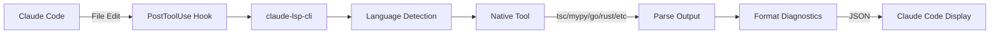

# Claude Code LSP

[](https://github.com/teamchong/claude-lsp-cli/actions/workflows/ci.yml)
[](https://github.com/teamchong/claude-lsp-cli/actions/workflows/test.yml)
[](https://github.com/teamchong/claude-lsp-cli/actions/workflows/test.yml)
[](https://opensource.org/licenses/MIT)

A lightweight, file-based diagnostics CLI for Claude Code that provides real-time type checking and error detection for 11+ programming languages without requiring language servers.

## ✨ Features

- **🚀 Direct Tool Invocation** - No language servers needed, uses native compilers/linters
- **📦 Single Binary** - Compiled with Bun for fast execution
- **🔧 Auto-Installation** - Hooks automatically installed to Claude Code
- **🎯 Smart Deduplication** - Only shows diagnostics when they change
- **🌍 11+ Languages** - TypeScript, Python, Go, Rust, Java, C++, PHP, Scala, Lua, Elixir, Terraform
- **⚡ Fast & Lightweight** - File-based checking with minimal overhead

## 📦 Installation

### From Source (Recommended)

Choose the installer based on your shell:

#### Option 1: Bash Scripts (Linux/macOS)

```bash
# Clone the repository
git clone https://github.com/teamchong/claude-lsp-cli.git
cd claude-lsp-cli

# Install with automatic setup
./install.sh
```

#### Option 2: PowerShell Scripts (Cross-Platform)

Works on Windows, macOS, and Linux with PowerShell Core:

```powershell
# Clone the repository
git clone https://github.com/teamchong/claude-lsp-cli.git
cd claude-lsp-cli

# Windows (PowerShell)
powershell -ExecutionPolicy Bypass -File install.ps1

# macOS/Linux (PowerShell Core)
# Install PowerShell Core first if needed:
#   macOS: brew install powershell
#   Linux: https://docs.microsoft.com/powershell/scripting/install/installing-powershell-on-linux
pwsh ./install.ps1
```

The installer automatically:

1. Checks for required dependencies (Bun)
2. Builds the CLI binary with `bun run build`
3. Installs binary to system location
   - Linux/macOS: `/usr/local/bin/claude-lsp-cli` (requires sudo)
   - Windows: `%LOCALAPPDATA%\Programs\claude-lsp-cli\`
4. Adds PostToolUse hooks to Claude Code settings
5. Updates `CLAUDE.md` with usage instructions
6. Configures PATH if needed

### From NPM (Coming Soon)

```bash
# Install globally
npm install -g claude-lsp-cli-lsp

# Or use directly with npx
npx claude-lsp-cli diagnostics src/file.ts
```

## 🎯 Usage

### CLI Commands

```bash
# Show help
claude-lsp-cli

# Check a specific file
claude-lsp-cli diagnostics src/index.ts

# Enable/disable languages
claude-lsp-cli disable python
claude-lsp-cli enable python
```

### Quick Commands in Claude Code

After installation, the tool automatically checks your code after every file edit. You can also use CLI commands directly in Claude Code sessions:

```bash
# Check status of language checkers
!claude-lsp-cli status

# Enable/disable specific languages
!claude-lsp-cli enable python
!claude-lsp-cli disable scala

# Manually check a specific file
!claude-lsp-cli check /path/to/file.ts

# Get help
!claude-lsp-cli help
```

**Tip:** Use `Ctrl+R` in Claude Code to search command history for quick access to previously used commands.

## 🔧 How It Works

### Architecture



### Hook System

The CLI integrates with Claude Code through a PostToolUse hook that automatically checks files after edits.

### Deduplication

To prevent spam, the system tracks diagnostics per project:

- State files: `/tmp/claude-lsp-last-{project-hash}.json`
- Only shows output when diagnostics change
- Per-project tracking for multi-project workspaces

## 🌍 Language Support

| Language   | Tool Used                   | File Extensions | Status     |
| ---------- | --------------------------- | --------------- | ---------- |
| TypeScript | `tsc --noEmit`              | `.ts, .tsx`     | ✅ Enabled |
| Python     | `pyright` or `mypy`         | `.py`           | ✅ Enabled |
| Go         | `go build`                  | `.go`           | ✅ Enabled |
| Rust       | `rustc --error-format json` | `.rs`           | ✅ Enabled |
| Java       | `javac`                     | `.java`         | ✅ Enabled |
| C/C++      | `g++` or `clang++`          | `.cpp, .cc, .c` | ✅ Enabled |
| PHP        | `php -l`                    | `.php`          | ✅ Enabled |
| Scala      | `scalac`                    | `.scala`        | ✅ Enabled |
| Lua        | `lua -l`                    | `.lua`          | ✅ Enabled |
| Elixir     | `elixir -c`                 | `.ex, .exs`     | ✅ Enabled |
| Terraform  | `terraform validate`        | `.tf`           | ✅ Enabled |

## 🧪 Testing

Test the diagnostics with example files:

```bash
# TypeScript - multiple errors
claude-lsp-cli diagnostics examples/typescript-project/src/index.ts

# Python - multiple errors
claude-lsp-cli diagnostics examples/python-project/main.py

# Go - multiple errors
claude-lsp-cli diagnostics examples/go-project/cmd/server/main.go

# Rust - multiple errors
claude-lsp-cli diagnostics examples/rust-project/src/main.rs
```

## ⚙️ Configuration

### Global Config

Language preferences are stored in `~/.claude/lsp-config.json`:

```json
{
  "disabled": ["python", "scala"]
}
```

## 🔌 Hook Format

The hooks use Claude Code's nested format:

```json
{
  "hooks": {
    "PostToolUse": [
      {
        "hooks": [
          {
            "type": "command",
            "command": "claude-lsp-cli hook PostToolUse"
          }
        ]
      }
    ],
    "UserPromptSubmit": [
      {
        "hooks": [
          {
            "type": "command",
            "command": "claude-lsp-cli hook UserPromptSubmit"
          }
        ]
      }
    ]
  }
}
```

## 🗑️ Uninstallation

Choose the uninstaller based on your shell:

#### Option 1: Bash Script (Linux/macOS)

```bash
# Run the uninstaller
./uninstall.sh
```

#### Option 2: PowerShell Script (Cross-Platform)

```powershell
# Windows (PowerShell)
powershell -ExecutionPolicy Bypass -File uninstall.ps1

# macOS/Linux (PowerShell Core)
pwsh ./uninstall.ps1
```

The uninstaller removes:

1. CLI binary from system location
2. PostToolUse hooks from Claude Code settings
3. LSP section from `CLAUDE.md`
4. Temporary diagnostic state files
5. PATH entries (Windows only)

## 🏗️ Development

### Building from Source

```bash
# Install dependencies
bun install

# Build the CLI
bun run build

# Test locally
./bin/claude-lsp-cli diagnostics src/cli.ts
```

### Publishing to NPM

```bash
# The package is configured for npm publishing
npm publish
```

Package includes only:

- Compiled binary (`bin/claude-lsp-cli`)
- README.md
- LICENSE
- package.json

## 📝 Diagnostic Format

The system outputs diagnostics in a standardized JSON format:

```json
{
  "diagnostics": [
    {
      "file": "src/index.ts",
      "line": 10,
      "column": 5,
      "severity": "error",
      "message": "Cannot find name 'foo'",
      "code": "TS2304"
    }
  ],
  "summary": "1 error, 0 warnings"
}
```

## 🤝 Contributing

Contributions are welcome! Please feel free to submit issues and pull requests.

### Adding Language Support

To add a new language:

1. Add the checker in `src/file-checker.ts`
2. Implement output parser for the tool
3. Add test examples in `examples/`
4. Update this README

## 📄 License

MIT

## 🙏 Acknowledgments

Built with [Bun](https://bun.sh) for fast execution and easy distribution.
